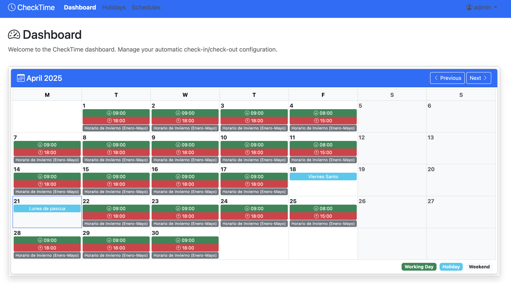
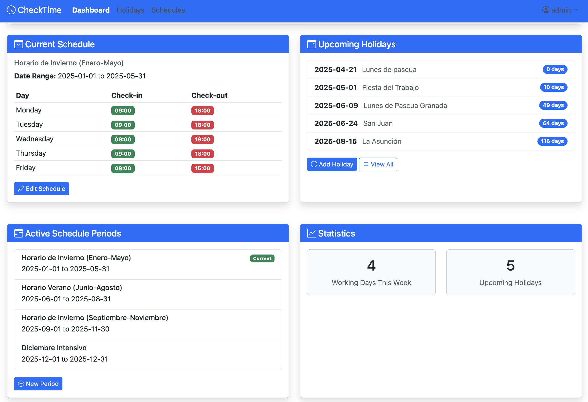
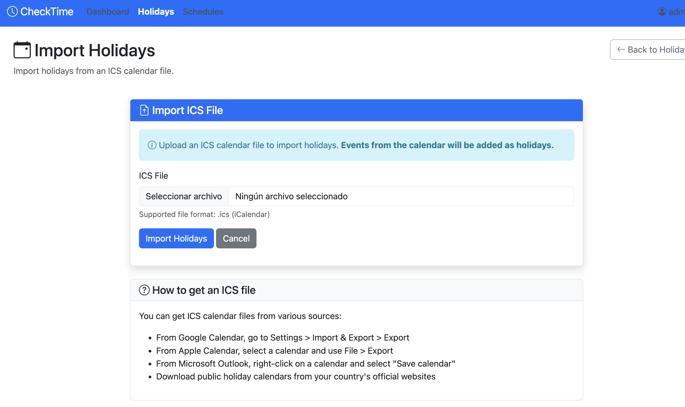
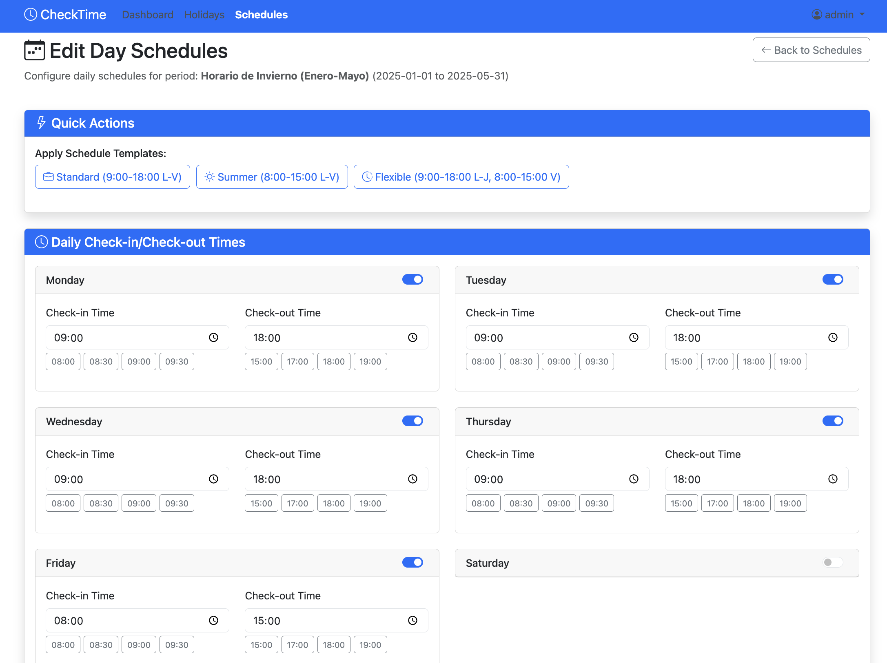

# CheckTime

An application for automating check-in and check-out on the CheckJC system.

## Features

- Automated check-in and check-out on working days
- Automatic detection of weekends and holidays
- Telegram integration for notifications and commands
- Web interface to configure schedules and holidays

## Screenshots

### Dashboard

The main dashboard displays a monthly calendar with daily check-in and check-out times.


The dashboard also shows current schedule, upcoming holidays, active schedule periods, and statistics.

### Holiday Management

Easily import holidays from ICS calendar files.

### Schedule Management

Edit daily schedules with an intuitive interface.

## Service Architecture

CheckTime is organized into four independent services, each with a single responsibility:

1. **Web Service**: Provides the web user interface for system administration
2. **Check-in Service**: Performs automatic clock-in/clock-out according to configured schedules
3. **Bot Service**: Handles Telegram integration for notifications and commands
4. **Database Service**: Manages persistent data storage (SQLite) for schedules, holidays, and configuration

This separation ensures greater stability, maintainability, and scalability of the system.

## Services Explained

### Web Service
The web interface provides an intuitive dashboard for administrators to:
- View current configuration and system status
- Manage holidays (add individual days or date ranges)
- Configure schedule periods (e.g., summer schedule, winter schedule)
- Set check-in/check-out times for each day of the week
- Synchronize holiday data between database and check-in service

### Check-in Service
This service handles the automation of clock-in/clock-out actions:
- Runs according to the schedules configured in the web interface
- Automatically detects and skips weekends and holidays
- Uses a Chrome webdriver to interact with the CheckJC system
- Logs all actions for auditing and troubleshooting
- Sends notifications of successful or failed check-ins via Telegram

### Bot Service
The Telegram bot provides remote management capabilities:
- Allows holiday management directly from your phone
- Sends notifications about check-in/check-out events
- Provides status updates about the system
- Allows administrators to add, remove, or list holidays remotely

### Database Service
Manages a SQLite database that stores:
- Holiday information (date and description)
- Schedule periods and their date ranges
- Daily check-in/check-out times for each schedule period

## Telegram Commands

The following commands are available in the Telegram bot:

- `/addfestivo YYYY-MM-DD [description]` - Add a new holiday date with optional description
  Example: `/addfestivo 2023-12-25 Christmas Day`

- `/delfestivo YYYY-MM-DD` - Delete a holiday date
  Example: `/delfestivo 2023-12-25`

- `/listfestivos` - List upcoming holidays for the current year
  Shows dates, descriptions, and how many days until each holiday

## Requirements

- Python 3.8+
- Google Chrome
- ChromeDriver (compatible with your installed Chrome version)
- Docker and Docker Compose (recommended for deployment)

## Configuration

1. Copy the `.env.example` file to `.env` and configure the environment variables:
   ```
   cp .env.example .env
   ```

2. Edit the `.env` file with your credentials and configuration:
   ```
   # Credentials
   CHECKJC_USERNAME=your_username
   CHECKJC_PASSWORD=your_password
   
   # Telegram (optional)
   TELEGRAM_BOT_TOKEN=your_token
   TELEGRAM_CHAT_ID=your_chat_id
   
   # Web Configuration
   FLASK_SECRET_KEY=flask_secret_key
   ADMIN_PASSWORD=admin_password
   ```

## Installation and Execution

### With Docker Compose (recommended)

1. Build and run all services:
   ```
   docker compose up -d
   ```

2. Access the web interface at: http://localhost:5000

3. To start specific services:
   ```
   docker compose up -d web    # Just the web interface
   docker compose up -d fichar # Just the check-in service
   docker compose up -d bot    # Just the Telegram bot
   docker compose up -d db     # Just the database
   ```

   Note: The database service automatically starts as a dependency when other services are started.

### Without Docker (Development)

1. Create a virtual environment and install dependencies:
   ```
   python -m venv venv
   source venv/bin/activate  # On Windows: venv\Scripts\activate
   pip install -r requirements.txt
   pip install -e .
   ```

2. Run each service separately:
   ```
   # Web interface
   python -m src.checktime.web.server
   
   # Check-in service
   python -m src.checktime.fichaje.service
   
   # Telegram bot
   python -m src.checktime.bot.listener
   ```

## Using the Web Interface

1. Access http://localhost:5000
2. Log in with username `admin` and the password configured in `ADMIN_PASSWORD`
3. From the dashboard you can:
   - View summary of current configuration
   - Manage holidays
   - Configure schedule periods
   - Set check-in/check-out times for each day of the week

## License

This project is licensed under the MIT License. 