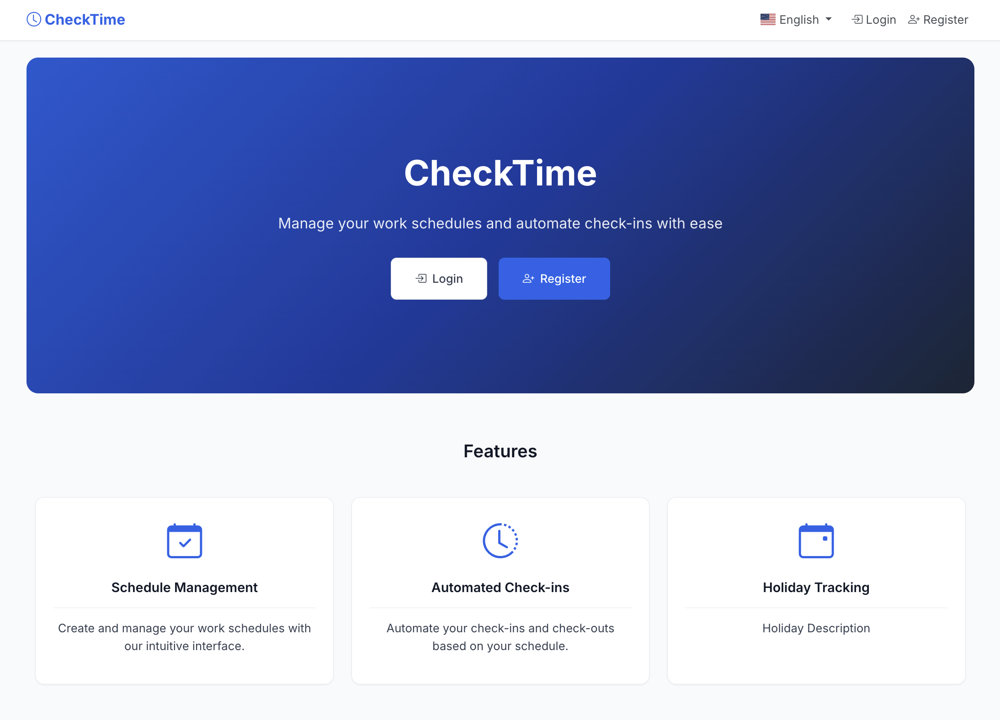
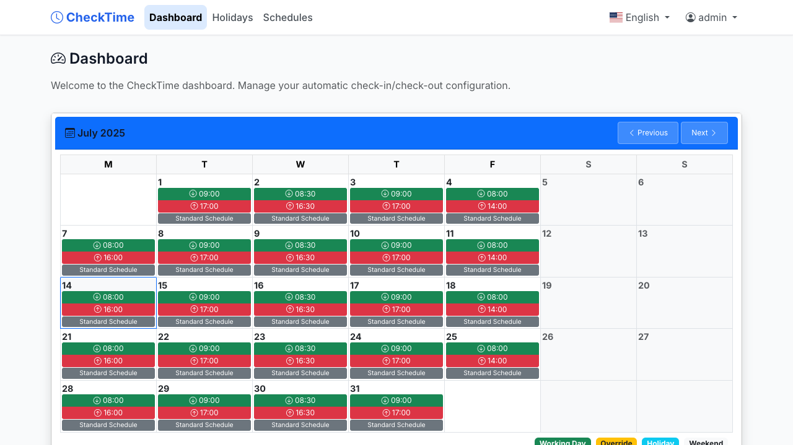
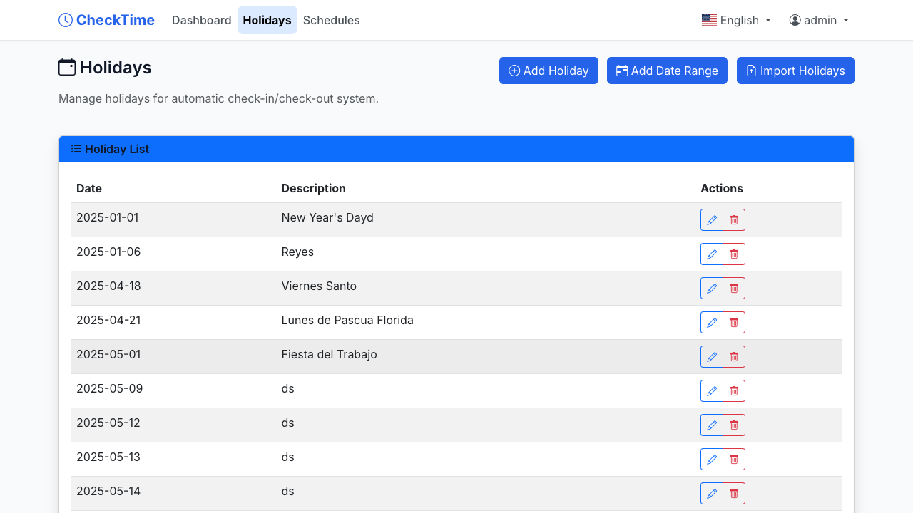
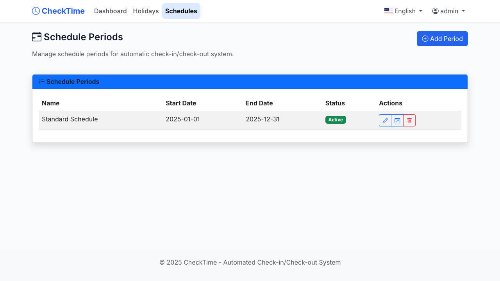

# CheckTime

CheckTime is a comprehensive, self-hosted application designed to automate browser-based check-ins and check-outs. It features a full-fledged web interface for management, a Telegram bot for notifications and quick actions, and a robust scheduling system.

---

## Table of Contents

- [Features](#features)
- [Architecture](#architecture)
- [Technology Stack](#technology-stack)
- [Getting Started](#getting-started)
  - [Prerequisites](#prerequisites)
  - [Configuration](#configuration)
  - [Installation](#installation)
- [Usage](#usage)
  - [Web Interface](#web-interface)
  - [Telegram Bot](#telegram-bot)
- [License](#license)

---

## Features

- **Automated Clocking**: Automatically performs check-ins and check-outs based on user-defined schedules.
- **Multi-User Support**: Each user has their own credentials, schedules, and settings.
- **Flexible Scheduling**:
    - Create multiple schedule periods (e.g., "Summer Hours," "Standard Hours").
    - Define specific check-in/out times for each day of the week.
    - Override schedules for specific dates without altering the main schedule.
- **Holiday Management**:
    - Add holidays individually or for a date range.
    - Import holidays from `.ics` (iCalendar) files.
    - Holidays are respected by the scheduler, preventing actions on non-working days.
- **Interactive Web Dashboard**:
    - A visual calendar that displays work days, holidays, and overrides.
    - Manage users, schedules, and system settings.
    - AJAX-powered for a smooth, single-page application feel.
- **Telegram Integration**:
    - Receive real-time notifications for check-ins, check-outs, and errors.
    - Add or remove holidays via simple bot commands.
    - Get your `chat_id` for easy setup.
- **Containerized Deployment**: Packaged with Docker and Docker Compose for easy and consistent deployment.

---

## Architecture

CheckTime is a monolithic application composed of three main processes running within a single Docker container, orchestrated by `supervisord`. This design ensures that all components share the same environment and can communicate efficiently.

- **Database (`db` service)**: A **PostgreSQL** container that provides persistent storage for all application data.
- **Application (`app` service)**: A single Docker container running three core processes:
    1.  **Web Process**: A **Flask** application served by **Gunicorn**. It provides the main user interface for managing the system.
    2.  **Scheduler Process**: A background service that uses the `schedule` library to trigger check-ins/outs. It leverages **Selenium** to interact with the target time-tracking website.
    3.  **Bot Process**: A **python-telegram-bot** listener that handles incoming commands and sends notifications.

All processes within the `app` service share a common business logic layer (`services`) and data access layer (`repositories`), ensuring code is reusable and the architecture is clean.

---

## Technology Stack

- **Backend**: Python, Flask, SQLAlchemy
- **Frontend**: Jinja2, JavaScript, AJAX, Bootstrap
- **Database**: PostgreSQL
- **Automation**: Selenium
- **Deployment**: Docker, Docker Compose, Gunicorn, Supervisord
- **Notifications**: Telegram

---

## Getting Started

### Prerequisites

- **Docker**: For running the application in containers.
- **Docker Compose**: To orchestrate the multi-service application.

### Configuration

1.  **Create the Environment File**: Copy the example file to create your own configuration.
    ```bash
    cp .env.example .env
    ```

2.  **Edit the `.env` File**: Open the `.env` file and fill in the required values. This is a **mandatory** step.
    - **Database Settings**: `POSTGRES_USER`, `POSTGRES_PASSWORD`, `POSTGRES_DB`.
    - **Application Settings**: `FLASK_SECRET_KEY` (generate a new secret key), `ADMIN_PASSWORD`.
    - **Telegram Bot**: `TELEGRAM_BOT_TOKEN` (get this from BotFather).
    - **Ports**: `WEB_PORT` (the external port for the web UI), `POSTGRES_DB_PORT`.

### Installation

With Docker and Docker Compose installed, running the application is straightforward:

1.  **Build and Start the Services**:
    ```bash
    docker-compose up --build -d
    ```
    This command builds the `app` image and starts the application and database containers in the background.

2.  **Access the Web Interface**:
    Open your browser and navigate to `http://localhost:<WEB_PORT>` (replace `<WEB_PORT>` with the port you configured in `.env`).

3.  **Monitor Logs**:
    To view the logs from all running services:
    ```bash
    docker-compose logs -f
    ```

---

## Usage

### Web Interface

1.  **Login**: On first launch, log in with the username `admin` and the `ADMIN_PASSWORD` you set in the `.env` file.
2.  **Register Your User**: It is recommended to register a new, non-admin user for daily operations.
3.  **Configure Your Profile**:
    - In the profile section, enter your credentials for the time-tracking website (`CheckJC`).
    - Set your Telegram `chat_id` to enable notifications.
4.  **Set Up Schedules**: Navigate to the "Schedules" section to define your work periods and daily check-in/out times.
5.  **Add Holidays**: Go to the "Holidays" section to add your vacation days or import a calendar.

### Telegram Bot

-   **/start**: Get a welcome message with available commands.
-   **/getchatid**: Returns your unique Telegram Chat ID, which you need to add to your profile in the web UI to receive notifications.
-   **/addfestivo YYYY-MM-DD [Description]**: Add a new holiday.
-   **/delfestivo YYYY-MM-DD**: Remove an existing holiday.
-   **/listfestivos**: List all upcoming holidays.

---

## Screenshots

**Home**


**Dashboard**


**Holidays**


**Schedules**


---

## License

This project is licensed under the **MIT License**. See the [LICENSE](LICENSE) file for details.
