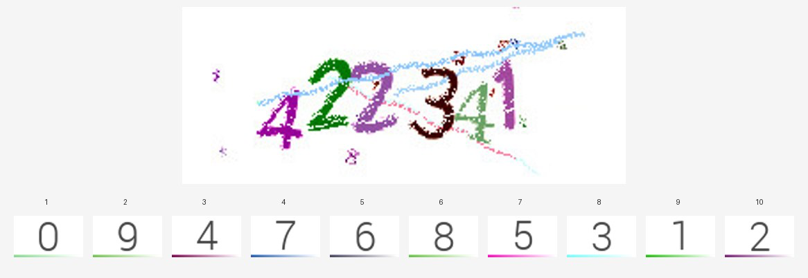
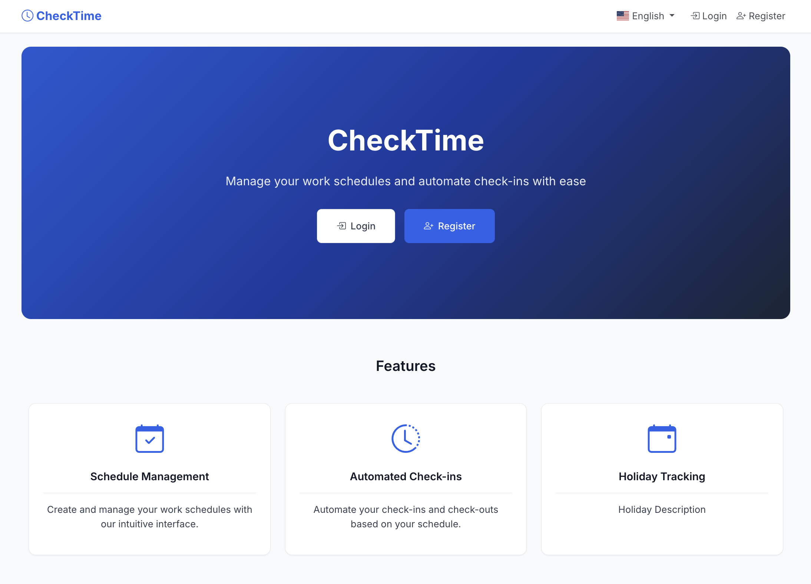
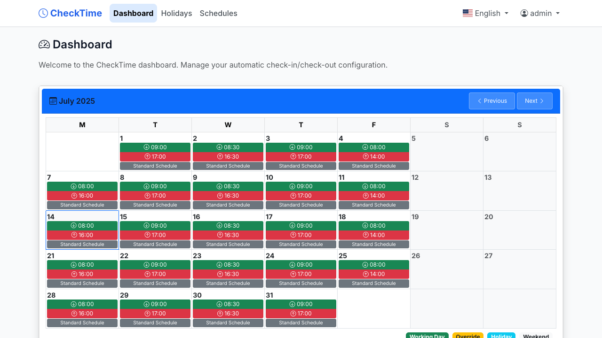
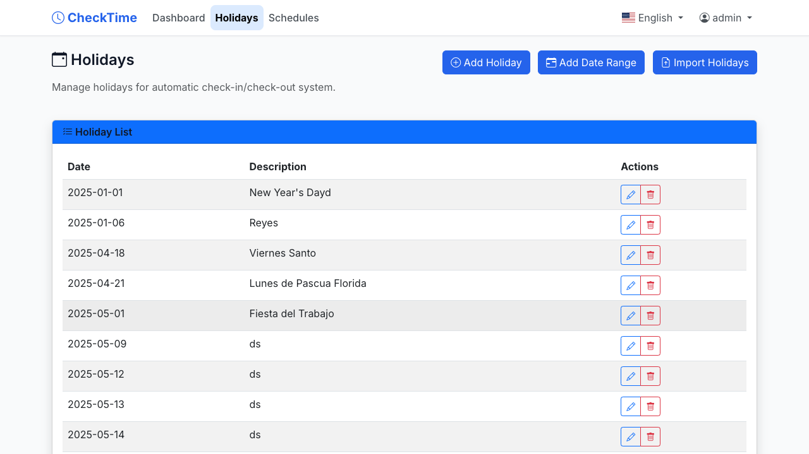
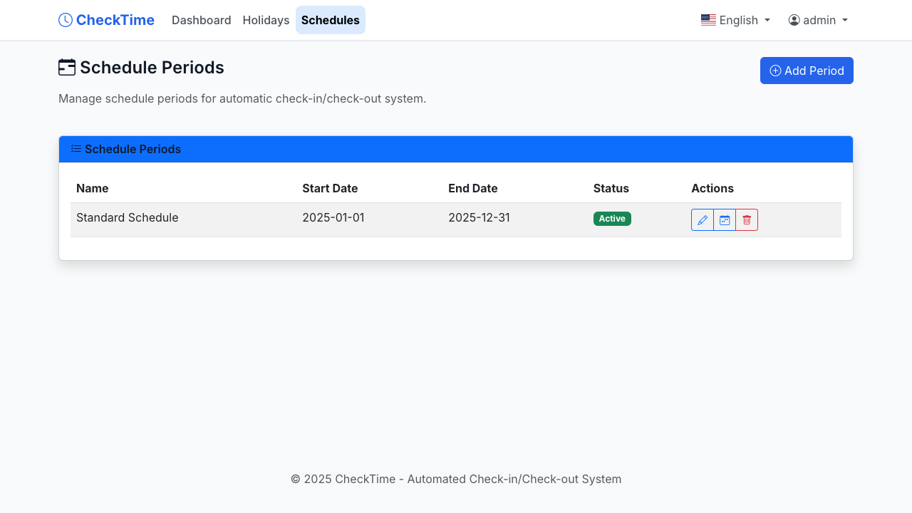

# CheckTime

CheckTime is a self-hosted application that automates browser‑based
check‑ins and check‑outs against [CheckJC](https://www.checkjc.com/).
It ships a Flask web UI for management, a Telegram bot for
notifications and quick actions, and a scheduler that drives a real
Chromium via Playwright. It is designed to handle CheckJC's modern
anti‑bot defences (Stencil + closed shadow DOM, lite‑variant rate
limiting, and the 6‑digit verification captcha).

---

## Table of Contents

- [Features](#features)
- [Architecture](#architecture)
- [Technology Stack](#technology-stack)
- [Anti‑detection: the InfoJC lockout report](#anti-detection-the-infojc-lockout-report)
- [How the CheckJC captcha is handled](#how-the-checkjc-captcha-is-handled)
- [Getting Started](#getting-started)
  - [Prerequisites](#prerequisites)
  - [Configuration](#configuration)
  - [Installation](#installation)
- [Usage](#usage)
  - [Web Interface](#web-interface)
  - [Telegram Bot](#telegram-bot)
- [Deployment with the prebuilt image](#deployment-with-the-prebuilt-image)
- [Change history](#change-history)
- [Screenshots](#screenshots)
- [License](#license)

---

## Features

### Automated check‑in / check‑out

- Multi‑user: each user has their own CheckJC credentials, schedule, and
  Telegram settings. Credentials are encrypted at rest.
- Multiple **schedule periods** (e.g. *Winter Hours*, *Summer Hours*)
  with different times per weekday.
- Per‑date **overrides** to adjust a single day without touching the
  recurring schedule.
- **Holidays** added one by one, by date range, or imported from a
  `.ics` calendar.
- **Stagger** between consecutive users so a single shared egress IP
  doesn't trip CheckJC's anti‑bot.
- **Anti‑detection humanization** so the scheduler looks like a real
  user, not a bot. Layered defences added across the v1.10.x → v1.11
  series after CheckJC's IDS issued a lockout report in May 2026:
  - **±5 min per‑day deterministic offset** on the configured fichaje
    time (seeded by user + date + check type) so it does not fire at
    `HH:MM:00` every day, plus 0‑30 s extra jitter within the matched
    minute.
  - **20‑90 s "human think" pause** between login and the actual
    fichaje click (was 1‑2 s — the most damning pattern in the report).
  - **Human‑cadence keystrokes** (60‑180 ms per char, real
    `isTrusted` `keydown`/`keypress`/`keyup`) instead of the previous CDP
    `Input.insertText` that fired no events, followed by an **immediate
    native Enter** submit (no field manipulation — see below).
  - **Mouse warmup** with intermediate positions before clicks.
  - **Stealth init script** with `navigator.webdriver = false` (the human
    value, not `undefined`), realistic `plugins`/`mimeTypes`, full
    `chrome.{app,runtime,csi,loadTimes}`, coherent
    `platform`/`vendor`/`screen`/`userAgentData`, and a
    `Function.prototype.toString` proxy so the spoofs report
    `[native code]`.
  - **rebrowser‑playwright** to remove the `Runtime.enable` CDP leak.
  - **Real Chrome UA** + randomized viewport + Spanish locale/timezone.
  - **Human captcha timing**: 1‑3 s "reading" pause, 0.4‑1.2 s between
    keypad clicks, 0.6‑1.5 s "verifying" pause before submit.
  - **Dashboard scroll** before clicking the fichaje button.
  - All knobs are env‑tunable (`CHECKJC_*` in `.env.example`).
- **Single `/login` submit per fichaje, by design**: the POST never
  happens twice in the same session. `CHECKJC_LITE_RETRIES=0` by
  default means even the `/login` GET is single‑shot (configurable up
  to 1, hard‑capped to 1 in code).
- Per‑user **account lockout** and **IP block** detection that stops
  the scheduler immediately and notifies via Telegram, *before*
  CheckJC's threshold can be hit.
- Resilient to CheckJC v7.4: closed shadow DOM is traversed via CDP,
  Stencil hydration timing is handled with bounded waits.

### CheckJC verification captcha

CheckJC v7.4+ shows a 6‑digit captcha plus a shuffling on‑screen
keypad after login. CheckTime supports **two solvers**, plugged into
the same `CaptchaSolver` interface and chosen automatically:

1. **Google Gemini** (`LLMVisionSolver`) — fully automatic. The user
   pastes a Gemini API key in their profile and the scheduler asks
   the LLM to read both the captcha and the keypad in one call.
   Default model is `gemini-2.5-flash-lite` (free tier, ~$0/month).
2. **Telegram human relay** (`TelegramHumanSolver`) — fallback when
   no API key is set or the LLM fails for any reason. The scheduler
   posts a composite image to the user's Telegram chat and waits up
   to 5 minutes for the user to reply with 16 digits.

See [the captcha section](#how-the-checkjc-captcha-is-handled) for the
visual.

### Web interface

- Calendar view with working days, holidays, overrides.
- Schedule and holiday management.
- **User profile** with: account, CheckJC credentials, Telegram, and
  Google Gemini API key + model dropdown.
- **Password recovery** with two paths:
  - Self‑service: token delivered over Telegram (no SMTP needed).
  - Admin fallback: one‑time temporary password from the admin user
    list.
- **Admin pages** (only visible for `is_admin`):
  - User list with reset‑password and delete buttons.
  - Telegram broadcast with per‑recipient checkboxes (not just
    "send to everyone").

### Telegram bot

- Real‑time notifications for successful and failed fichajes (typed
  per error class: 🟢 ok, 🚫 IP blocked, ⛔ account locked, 🧩 captcha
  failed, ⏳ session lost, ❌ unknown).
- Add / remove / list holidays via chat commands.
- Receives captcha replies and forwards them to the scheduler via the
  shared database.

---

## Architecture

```
┌──────────┐      ┌──────────────────────────────────────────┐
│ PostgreSQL │◀────┤ supervisord                              │
└──────────┘      │   ├── gunicorn (Flask web UI)            │
                  │   ├── scheduler.service (apscheduler +    │
                  │   │     Playwright + CaptchaSolver)       │
                  │   └── bot.listener (Telegram long‑poll)   │
                  └──────────────────────────────────────────┘
                              │
                              ▼
                    ┌────────────────────┐
                    │ trainingX.checkjc  │
                    │ .com (real browser │
                    │ via Playwright)    │
                    └────────────────────┘
```

The web, scheduler and bot processes share the same Flask `db.session`
and business‑logic layer (`shared/services` + `shared/repository`).
The captcha relay uses a `pending_captcha` table to bridge the
scheduler (which waits for a reply) and the bot (which receives it).

Production should egress from a **stable, legitimate Spanish IP**.
> ⚠️ Earlier setups routed the `app` container through Gluetun + NordVPN.
> Per InfoJC's May 2026 report, those NordVPN IPs were a *cause* of the
> lockout, not a fix — avoid VPN/datacenter egress. See
> [Anti‑detection](#anti-detection-the-infojc-lockout-report).

---

## Technology Stack

- **Backend**: Python 3.11, Flask, SQLAlchemy, Flask‑Login, Flask‑WTF
- **Frontend**: Jinja2, Bootstrap 5, vanilla JS / AJAX
- **Database**: PostgreSQL 15
- **Browser automation**: Playwright + Chromium (real browser, with
  CDP for closed shadow DOM traversal)
- **LLM solver**: Google Gemini (`gemini-2.5-flash-lite` by default,
  configurable per user)
- **Image composition**: Pillow
- **Encryption at rest**: `cryptography.fernet` (CheckJC password and
  Gemini API key)
- **Deployment**: Docker, Docker Compose, Gunicorn, Supervisord;
  prebuilt images on **GitHub Container Registry**
  (`ghcr.io/gonzalez8/checktime`).

---

## Anti-detection: the InfoJC lockout report

On **28 May 2026** CheckJC's provider (InfoJC) issued a formal report
explaining why user `REDACTED_USER` was locked out on
`example-subdomain.checkjc.com`. The lockout was attributed to a *sum of
factors*, not a single cause. CheckTime's anti‑detection work
(v1.10 → v1.12) is organised directly around eliminating each one. The
table below is the canonical checklist — review it before pointing the
bot at a real account.

| # | Factor flagged by InfoJC | Status | How CheckTime addresses it |
|---|---|---|---|
| 1 | Invalid/expired TLS suite/certificate | ✅ Resolved | Uses a real, current Chromium (rebrowser‑playwright) with a modern, valid TLS stack. The lightweight HTTP clients (urllib/curl_cffi) that triggered this are gone. |
| 2 | Path scanning + header manipulation during login | ✅ Resolved | Navigates straight to `/login`; sends only the headers a real Chrome sends (UA, Accept‑Language, Sec‑CH‑UA), all internally coherent — nothing injected or anomalous. |
| 3 | Blacklisted client `HeadlessChrome/135` | ✅ Resolved | `--headless=new` drops the `HeadlessChrome` token; UA / Sec‑CH‑UA / `navigator.userAgentData` are pinned to a coherent `Chrome/136` on Linux, derived from the real engine version. |
| 4 | Repeated logins with **wrong credentials** | ✅ Resolved* | Hard cap of **2 attempts per session**, never retries on rejection. *Keep the stored CheckJC password current — a stale one would generate wrong‑credential attempts. |
| 5 | **Manipulating fields/controls** | ✅ Resolved | Only **real `isTrusted` keystrokes** + native **Enter** submit. All synthetic `dispatchEvent`, forced `.value` setting and CDP `Input.insertText` were removed from the login path in **v1.12.12**. |
| 6 | Rapid consecutive logins, no wait, IP hopping | ✅ Resolved | One login per fichaje, ≥60 s backoff between the (max 2) attempts, **no double‑submit**, no IP changes. |
| 7 | Behavioural pattern: always `09:00:00` ±<1 min, fichaje 1‑2 s after login | ⚠️ Mitigated | ±N‑min per‑day deterministic offset + 0‑30 s jitter; 20‑90 s "human think" pause between login and fichaje; ~10 s human‑cadence typing. Widen the offsets further if you want more spread. |
| 8 | **Foreign/anomalous/VPN egress IP** (NordVPN, Italy) | ⚠️ Operational | **Not a code setting — it depends on where you host CheckTime.** Egress from a legitimate Spanish residential/business IP. Do **not** route through NordVPN or any VPN/datacenter range: the report explicitly named those NordVPN IPs (ASN 136787, Italy/Panama) as a block trigger. Verify with `curl -s https://ipinfo.io/json` (expect `country: ES`, a normal ISP, not a VPN ASN). |

> **Important — egress IP (factor 8):** earlier versions of this project
> routed the container through **Gluetun + NordVPN**. The InfoJC report
> showed that was *counter‑productive*: those NordVPN IPs were among the
> cited block reasons. The recommended setup is to egress from a stable,
> legitimate **Spanish** IP and avoid VPN/datacenter ranges entirely.

### What actually fixed the login (v1.12 series)

After weeks of `CheckJCLoginRejected` (the browser staying on `/login`
after submit), the breakthrough chain, in order, was:

1. **`navigator.webdriver = false`** (not `undefined`). A real Chrome
   returns `false`; `undefined` is itself anomalous and kept CheckJC's
   Stencil submit button **disabled**. Forcing the human value enabled
   the button.
2. **Full fingerprint hardening** — realistic `plugins`/`mimeTypes`,
   complete `chrome.{app,runtime,csi,loadTimes}`,
   `platform`/`vendor`/`hardwareConcurrency`/`deviceMemory`, coherent
   `screen`/`outerWidth`, and a `Function.prototype.toString` proxy so
   every spoof reports `[native code]` instead of its source.
3. **Live‑field + submit fix** — the password field is a Stencil
   *controlled* input that reconciled back to empty ~1 s after typing.
   The trigger turned out to be **our own synthetic `input`/`change`
   events**. Removing them and pressing **Enter immediately** after
   typing submits the form natively while the value is still present
   (`POST /login` → `302`). Confirmed end‑to‑end: a deliberately wrong
   test credential now returns CheckJC's normal *"Credenciales
   incorrectos"*, proving the whole pipeline works.

The net effect: the login now behaves like a real human session
(`isTrusted` events, native submission, no field manipulation), so
factors 1‑6 above are addressed in code. Factors 7 (behavioural) and 8
(egress IP) are the operational knobs left to the deployer.

---

## How the CheckJC captcha is handled

When CheckJC redirects the post‑login flow to
`/portal/employee/verification`, the scheduler captures **the
distorted 6‑digit captcha** and **the 10 keypad button images** and
composes them into a single labelled image:



The format is always the same: captcha on top, keypad strip below with
the buttons indexed `1` to `10` left to right. From that single
image, a solver returns the **6 letters** to click in order.

Why letters and not digits? CheckJC v7.4 attaches a per‑session
`data-value="<LETTER>"` to each button. The letter‑to‑digit mapping
is fixed for the whole session; only the **physical positions** of
the buttons reshuffle after every click. So the solver only has to
read the image once, and the scheduler does the rest by re‑reading
the DOM between clicks.

### Two solvers, same interface

| Solver | When it runs | Latency | Cost |
|---|---|---|---|
| `LLMVisionSolver` (Gemini) | User has `google_api_key` in profile | ~2 s | Free tier covers a typical 4 fichajes/day |
| `TelegramHumanSolver` | Always as fallback | as long as the user takes to reply (≤ 5 min) | Free |

The `HybridCaptchaSolver` chains them: try Gemini first; on any
failure (HTTP error, malformed reply, missing key) fall back to
Telegram automatically. This means existing users with Telegram
configured keep working exactly like before; users who add a Gemini
key get hands‑free fichaje.

Full design rationale lives in
[`docs/migrations/captcha-relay.md`](docs/migrations/captcha-relay.md)
and the original v7.4 migration is documented in
[`docs/migrations/checkjc-v7.4.md`](docs/migrations/checkjc-v7.4.md).

---

## Getting Started

### Prerequisites

- **Docker** and **Docker Compose** (or a single Docker host that can
  run both).
- A Telegram bot token from [@BotFather](https://t.me/botfather) for
  notifications and the captcha relay.
- *(Optional)* A Google Gemini API key from
  [aistudio.google.com](https://aistudio.google.com/app/apikey) per
  user who wants hands‑free captcha solving.

### Configuration

1. **Create the environment file**:
   ```bash
   cp .env.example .env
   ```

2. **Edit `.env`** and fill in the required values:

   | Variable | Purpose |
   |---|---|
   | `POSTGRES_USER` / `POSTGRES_PASSWORD` / `POSTGRES_DB` | Database |
   | `POSTGRES_DB_PORT` | External port for the DB (only needed if you connect from the host) |
   | `FLASK_SECRET_KEY` | Flask session signing key — generate a strong random string |
   | `ADMIN_PASSWORD` | Password for the auto‑provisioned `admin` user |
   | `ENCRYPTION_KEY` | Fernet key used to encrypt CheckJC passwords and Gemini API keys at rest |
   | `TELEGRAM_BOT_TOKEN` | From @BotFather |
   | `TELEGRAM_CHAT_ID` | Default chat ID for global / boot messages |
   | `WEB_PORT` / `PORT` | External / internal web port |
   | `CHECK_TIME_VERSION` | Tag of the prebuilt image to run (e.g. `1.9.6`) |
   | `USER_CHECK_STAGGER_SECONDS` | Default `60`. Seconds between consecutive users to dodge CheckJC's anti‑bot |
   | `CHECKJC_LITE_RETRIES` | Default `2`. Extra `/login` reload attempts when CheckJC serves the lite HTML |
   | `CHECKJC_LITE_RETRY_SECONDS` | Default `60`. Wait between those retries |

   The Gemini‑related settings are **per user**, configured from the
   web UI's profile page, not from `.env`.

### Installation

#### Local build (development)

```bash
docker-compose up --build -d
```

#### Prebuilt image (production)

Set `CHECK_TIME_VERSION` to the [latest release tag](https://github.com/Gonzalez8/checktime/releases)
in `.env` (or `stack.env` in Portainer), then:

```bash
docker compose pull app
docker compose up -d
```

Open `http://<your-host>:<WEB_PORT>`.

The first boot auto‑creates tables and applies any pending column
migrations (logged on startup). Log in with `admin` /
`$ADMIN_PASSWORD` and create your real user account.

---

## Usage

### Web Interface

1. **Login** with `admin` + `ADMIN_PASSWORD`.
2. **Register a real user** (recommended over using `admin` daily).
3. **Profile** tab → set up:
   - Account info and password.
   - **CheckJC credentials** (username, password, subdomain). Stored
     encrypted.
   - **Telegram chat ID** (use `/getchatid` in the bot to fetch
     yours).
   - *(Optional)* **Google API Key** + Gemini model dropdown. If
     left empty, the captcha is solved via Telegram instead.
4. **Schedules** → create one or more periods with weekday times.
5. **Holidays** → add manually, in bulk, or import an `.ics` file.
6. **Admin** menu (only `is_admin` users):
   - **Users**: list, reset password, delete users.
   - **Broadcast**: send a message to selected Telegram‑enabled users.

### Telegram Bot

- `/start` — welcome + command list.
- `/getchatid` — prints your chat ID, for the profile setup.
- `/addfestivo YYYY-MM-DD [Description]` — add a holiday.
- `/delfestivo YYYY-MM-DD` — remove a holiday.
- `/listfestivos` — list upcoming holidays.
- Reply to a captcha image with **16 digits** (`<10 keypad><6
  captcha>`) — the scheduler picks it up automatically. Used when no
  Gemini key is configured or as a fallback.

### Password recovery

- Login page → *Forgot password?* → enter username or email.
- If the user has Telegram configured, a one‑time reset link is sent
  there (no SMTP needed).
- If not, an admin can issue a one‑time temporary password from
  *Admin → Users → Reset password*.

---

## Deployment with the prebuilt image

CI publishes a tagged image to GitHub Container Registry on every
release tag (`vX.Y.Z`). The same image works for the standard and
Gluetun (VPN) compose flavours.

```bash
# Pick a release: https://github.com/Gonzalez8/checktime/releases
sed -i 's/^CHECK_TIME_VERSION=.*/CHECK_TIME_VERSION=1.9.6/' stack.env
docker compose pull app
docker compose up -d app
```

Two compose files are included:

- `docker-compose.yml` — standard deployment (recommended). Egress from
  a legitimate Spanish IP.
- `docker-compose.gluetun.yml` — routes the `app` container's egress
  through Gluetun + NordVPN. **Discouraged**: InfoJC's report named
  those NordVPN IPs as a block trigger (see
  [Anti‑detection](#anti-detection-the-infojc-lockout-report)). Kept only
  for reference / alternative non‑VPN egress wiring.

---

## Change history

Recent functionality, summarised. Each release has its own GitHub
release notes with full details and rationale.

| Version | What it added / fixed |
|---|---|
| **v1.12.12** | **Login submit fixed end‑to‑end.** Press **Enter immediately** after typing the password instead of the post‑typing dance (synthetic events, button poll, re‑resolve, click) — those gave the Stencil *controlled* password input ~1 s to reconcile back to empty, so native `required` validation aborted the POST. Now `POST /login` → `302` fires; a wrong test credential correctly returns "Credenciales incorrectos". Removed all field manipulation (synthetic `dispatchEvent`, forced `.value`, `Input.insertText`) from the login path — addresses InfoJC factor 5 |
| v1.12.8–v1.12.11 | **`navigator.webdriver = false`** (was `undefined`, which kept the Stencil submit button disabled). **Full fingerprint hardening**: realistic `plugins`/`mimeTypes`, complete `chrome.{app,runtime,csi,loadTimes}`, `platform`/`vendor`/`hardwareConcurrency`/`deviceMemory`, coherent `screen`/`outerWidth`, `Function.prototype.toString` proxy reporting `[native code]`. Diagnostics: live‑field value checks + `<form>` action/method capture |
| v1.12.0–v1.12.7 | Switch to **rebrowser‑playwright** (removes the `Runtime.enable` CDP leak anti‑bot stacks detect). UA/Sec‑CH‑UA derived from the real engine version. Per‑user login‑failure dump at `/var/log/checktime/login_failures/<user>.{html,png,txt}` (overwritten each time) surfaced in the **Diagnostics** admin page |
| **v1.11.0** | **±5 min per‑day deterministic schedule offset** seeded by `(user, date, check_type)` so the fichaje doesn't fire at the same minute every day. **Human captcha timing**: 1‑3 s read pause, 400‑1200 ms between clicks, 600‑1500 ms verify pause before submit. **Dashboard scroll** before clicking `#btn-check`. Targets the "always 09:00:XX" pattern flagged by InfoJC's IDS |
| v1.10.3 | Default `CHECKJC_LITE_RETRIES=0` — never retry `/login` automatically (hard‑capped to 1 in code). Cleanup of the error message that referenced the now‑removed NordVPN egress |
| v1.10.2 | `tests/debug_fichaje.py`: on‑demand standalone script that runs login + post‑login pause + check through the real `CheckJCClient`, mirroring the scheduler path. Useful for validating mitigations without waiting for the scheduled minute |
| v1.10.1 | **Per‑user Gemini captcha debug dump** at `/var/log/checktime/captcha_dumps/<user>.{png,txt}` overwritten on every call. Always logs Gemini's raw reply, `finishReason`, `promptFeedback`, `usageMetadata`. Composite image preserved for visual inspection. Disk footprint bounded by user count, not fichaje count |
| **v1.10.0** | **Humanize CheckJC login** end‑to‑end after the InfoJC May 2026 lockout report: stealth init script (`navigator.webdriver` + plugins), real keystroke events instead of CDP `Input.insertText`, mouse warmup with intermediate positions, viewport randomization, schedule jitter (0‑30 s), post‑login human pause (20‑90 s), lite‑variant retry hard‑cap with exponential backoff. Plus `logging_job=checktime` Docker label so Promtail pins `job="checktime"` in Loki |
| v1.9.6 | Default Gemini model `gemini-2.5-flash-lite`, `thinkingBudget=0` for compatibility with `gemini-2.5-flash`, bigger `maxOutputTokens` |
| v1.9.5 | Detect CheckJC per‑user account lockout banner; back off retries that contributed to bans |
| v1.9.4 | Extra Stencil hydration wait before submit on lite‑variant bodies *(retry portion reverted in 1.9.5)* |
| v1.9.3 | Hotfix: 500 on `/auth/profile` caused by duplicate `name=` kwarg on submit buttons |
| v1.9.2 | Bulletproof migrations: `information_schema` check + per‑statement transactions, diagnostic logging |
| v1.9.1 | Per‑user Gemini model dropdown; default moved to `2.5-flash`; fix migration transaction abort |
| **v1.9.0** | **Per‑user Google Gemini API key** in the profile. New `LLMVisionSolver` + `HybridCaptchaSolver` (LLM first, Telegram fallback) |
| v1.8.2 | Hotfix: scheduler app context for the captcha DB writes; plain‑text error notifications |
| v1.8.1 | Captcha solver asks for the **full 16 digits** (keypad + captcha) instead of relying on flaky Tesseract OCR |
| **v1.8.0** | **CheckJC verification captcha relay**: composite image shipped via Telegram, scheduler waits for the 6‑letter sequence and clicks |
| v1.7.4 | Detect lite‑variant DOM and retry without bailing on the first form‑not‑found |
| v1.7.3 | Retry on lite‑variant HTML; better diagnostics on `/login` failures |
| v1.7.2 | Stagger consecutive users in `schedule_check` to avoid the per‑IP anti‑bot |
| v1.7.1 | Delete users from the admin page; per‑recipient picker in the broadcast |
| **v1.7.0** | **Password recovery** via Telegram + admin fallback (one‑time temporary password) |
| v1.6.0 | Admin Telegram broadcast |
| v1.5.0 → v1.5.5 | Migration to Playwright + Chromium for CheckJC v7.4 |
| v1.4.0 | CheckJC subdomain configurable per user |
| v1.3.0 | Day overrides |
| v1.2.0 | Encrypted storage for CheckJC credentials |

Full release notes: <https://github.com/Gonzalez8/checktime/releases>

---

## Screenshots

**Home**


**Dashboard**


**Holidays**


**Schedules**


---

## License

This project is licensed under the **MIT License**. See the
[LICENSE](LICENSE) file for details.
